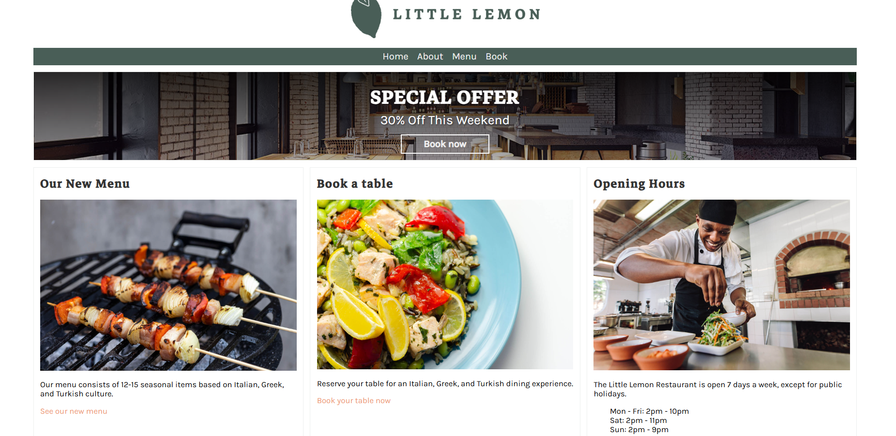
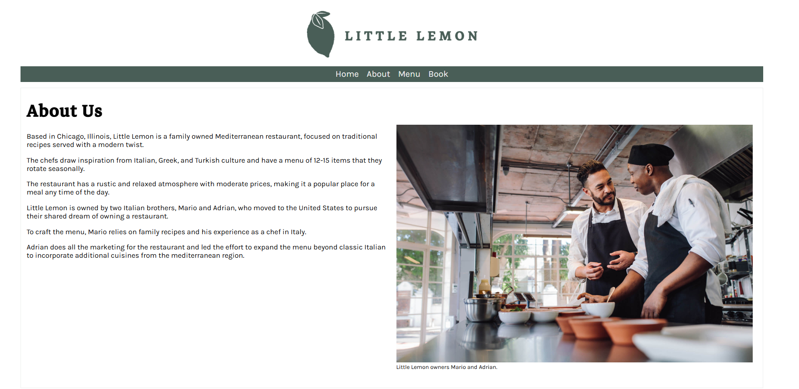
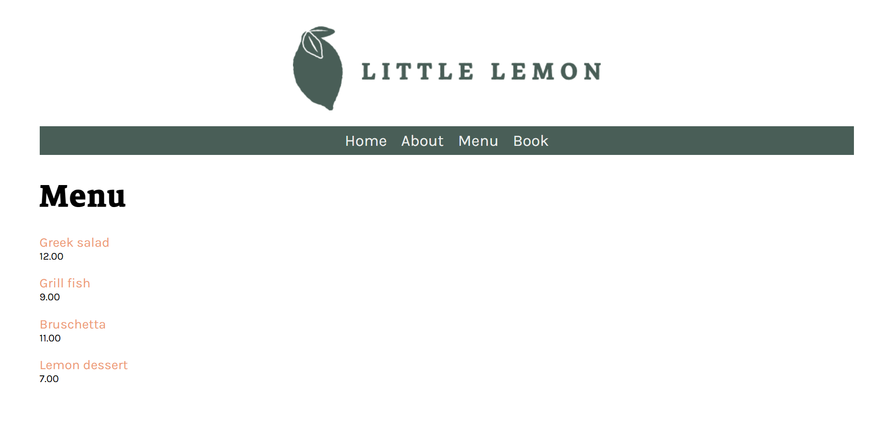
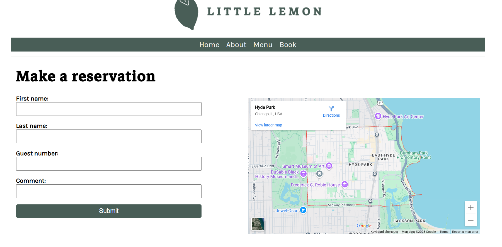

# Little Lemon  - Django Based Restaurant Booking System

This is a Django-based Restaurant booking system created as part of the [freeCodeCamp Django tutorial](https://www.freecodecamp.org/). The application simulates a booking system for a restaurant named **Little Lemon**, allowing users to show menu listed, booking using Django's built- system.

---

##  Features

- ✅ Showing Listed menu 
- ✅ Interacting webpage for Home, About, Menu, Book
- ✅ Django Admin Panel integration
- ✅ Pre Restaurant Booking System 


---


###  Tech Stack

| Layer       | Technologies                                   |
|-------------|------------------------------------------------|
| **Backend** | Django 4.x, Python 3.x                         |
| **Frontend**| HTML5, CSS3, Bootstrap 5, Animate.css, JS      |
| **Database**| SQLite (extensible to PostgreSQL/MySQL)        |
| **Admin**   | Django Admin Panel for full CRUD management    |

---

##  Screenshots


| Page | Preview |
|------|---------|
| Home |  |
| About |  |
| Menu |  |
| Book |  |

---

## 🛠️ Installation Guide

### 🔧 Prerequisites
- Python 3.8+
- Git
- Virtualenv *(Recommended)*
- SQLite (included with Python)

---

### 🧪 Local Setup

```bash
# Step 1: Clone the Repository
git clone https://github.com/01Anshuman/Littlelemon_Restaurant_Website.git
cd Littlelemon_Restaurant_Website

# Step 2: Create and Activate Virtual Environment
python -m venv venv
source venv/bin/activate  # Windows: venv\Scripts\activate

# Step 3: Install Required Packages
pip install -r requirements.txt

# Step 4: Apply Migrations
python manage.py makemigrations
python manage.py migrate

# Step 5: Collect Static Files
python manage.py collectstatic

# Step 6: Create Superuser
python manage.py createsuperuser

# Step 7: Run the Development Server
python manage.py runserver

---


